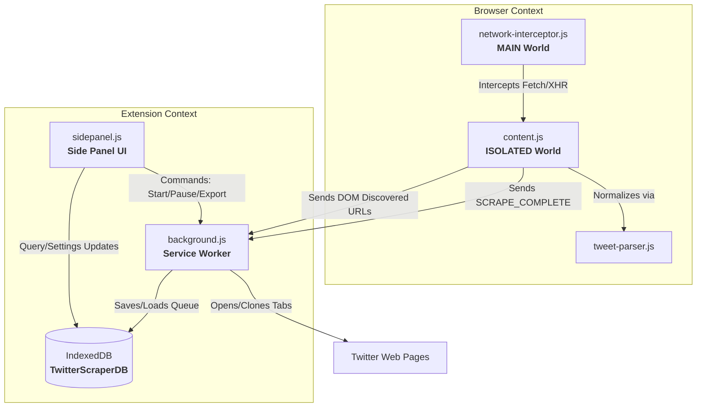

# Spaza Social Scraper (Chrome Extension)

An advanced, enterprise-grade Chrome Extension (Manifest V3) for media monitoring, social listening, and sentiment analysis. It discovers tweets in real-time as users browse, auto-scrolls to gather large datasets, and scrapes complete, high-fidelity post data (including full threads, author stats, media files, cards, and polls) by safely intercepting Twitter/X's internal GraphQL API responses.

---

## 📖 Table of Contents
1. [How It Works (Two-Phase Pipeline)](#-how-it-works-two-phase-pipeline)
2. [Architecture Overview](#-architecture-overview)
3. [Core Capabilities](#-core-capabilities)
4. [Data Model Schema](#-data-model-schema)
5. [Storage Architecture (IndexedDB)](#-storage-architecture-indexeddb)
6. [Network Interception Engine](#-network-interception-engine)
7. [Side Panel UI Spec](#-side-panel-ui-spec)
8. [Anti-Bot & Rate Limit Mitigation](#-anti-bot--rate-limit-mitigation)
9. [Project Directory Structure](#-project-directory-structure)
10. [Installation & Setup](#-installation--setup)

---

## 🔄 How It Works (Two-Phase Pipeline)

The extension operates as a decoupled, asynchronous two-phase ingestion pipeline to maximize efficiency and reduce the risk of bot-detection.

```
Phase 1: COLLECT (Passive DOM Discovery)
┌──────────────────────────────────────────────┐
│  User browses timeline / search / profile     │
└──────────────────────┬───────────────────────┘
                       │
                       ▼
┌──────────────────────────────────────────────┐
│  "Collect Tweets" clicked (FAB or Side Panel)│
└──────────────────────┬───────────────────────┘
                       │
                       ▼
┌──────────────────────────────────────────────┐
│  DOM Discoverer scans visible page for       │
│  links matching x.com/{user}/status/{id}     │
└──────────────────────┬───────────────────────┘
                       │
                       ▼
┌──────────────────────────────────────────────┐
│  Auto-Scroll Controller scrolls down         │
│  with natural randomized delays              │
└──────────────────────┬───────────────────────┘
                       │
                       ▼
┌──────────────────────────────────────────────┐
│  URLs saved to IndexedDB (status = 'queued')  │
└──────────────────────────────────────────────┘

Phase 2: SCRAPE (GraphQL Interception)
┌──────────────────────────────────────────────┐
│  User clicks "Start Scraping" in Side Panel  │
└──────────────────────┬───────────────────────┘
                       │
                       ▼
┌──────────────────────────────────────────────┐
│  Background worker fetches next queued URL   │
└──────────────────────┬───────────────────────┘
                       │
                       ▼
┌──────────────────────────────────────────────┐
│  Opens background tab -> main-world injection│
│  monkeypatches fetch / XMLHttpRequest        │
└──────────────────────┬───────────────────────┘
                       │
                       ▼
┌──────────────────────────────────────────────┐
│  Intercepts raw `TweetDetail` response       │
│  containing root tweet and full thread JSON  │
└──────────────────────┬───────────────────────┘
                       │
                       ▼
┌──────────────────────────────────────────────┐
│  Normalizer parses, validates, and stores    │
│  data in IndexedDB (status = 'scraped')      │
└──────────────────────┬───────────────────────┘
                       │
                       ▼
┌──────────────────────────────────────────────┐
│  Closes tab -> Pauses for safe cooling delay │
└──────────────────────┬───────────────────────┘
                       │
                       ▼
┌──────────────────────────────────────────────┐
│  Export to CSV, JSONL, or batch POST to API   │
└──────────────────────────────────────────────┘
```

---

## 🏗 Architecture Overview

The system spans four execution environments inside the Chrome sandbox, communicating via lightweight message passing and a shared IndexedDB instance.



### 1. MAIN World (`network-interceptor.js`)
* Injected at `document_start` on all matching patterns.
* Direct access to the page context; patches `window.fetch` and `window.XMLHttpRequest` to intercept GraphQL responses containing `TweetDetail`, `TweetResultByRestId`, and `TweetDetailWithInjections` queries.
* Communicates captured payloads back to the Isolated world via `window.postMessage`.

### 2. ISOLATED World (`content.js` + `tweet-parser.js`)
* Runs in the standard extension content script sandbox.
* Hosts the **DOM Discoverer** which extracts tweet URLs via CSS selectors (e.g. `article[data-testid="tweet"]`).
* Hosts the **Auto-Scroll Controller** which triggers smooth page scrolls.
* Receives raw JSON from the Main world, parses and extracts nested objects using the parser, and forwards completed payloads to the background service worker.

### 3. Service Worker (`background.js` + `db.js`)
* Handles state orchestration (`idle`, `scraping`, `paused`, `rate-limited`).
* Processes the queue: opens background tabs, assigns timeouts, monitors responses, and closes tabs.
* Executes exporting routines (local downloads or batched HTTP POST requests to third-party endpoints).

### 4. Side Panel (`sidepanel.html` + `sidepanel.js` + `sidepanel.css`)
* Provides an interactive console containing status badges, active queue items, a tabular scraped dataset, and configuration settings.

---

## 🌟 Core Capabilities

* **Full Thread Extraction:** Scrapes the parent tweet alongside replies, threaded conversation items, and secondary nested modules.
* **Long Post Support:** Automatically parses both short legacy posts (`full_text`) and modern extended/long tweets (`note_tweet`).
* **Rich Media Normalization:** Extracts image dimensions, alt text, and automatically resolves the highest-bitrate MP4 variant for video uploads.
* **Rich Poll & Card Parser:** Extracts card types, titles, binding values, active options, current voting results, and expiration dates.
* **Flexible Exports:** Downloads datasets locally in standard **CSV** format, **JSON Lines (JSONL)** format, or batches payloads to custom **API endpoints** using configurable authorization tokens.

---

## 📊 Data Model Schema

Each normalized post (tweets and replies alike) conforms to a strict, highly detailed model format.

### 1. Root Tweet / Reply Attributes
| Field | Type | Description |
| :--- | :--- | :--- |
| `id` | `string` | Unique identifier (snowflake ID) |
| `url` | `string` | Canonical link (`https://x.com/{screen_name}/status/{id}`) |
| `text` | `string` | Complete post text content (resolved note/full text) |
| `lang` | `string` | Detected language code (e.g., `en`, `es`) |
| `created_at` | `string` | Timestamp in standard Twitter API string format |
| `conversation_id` | `string` | Snowflake ID pointing to the root conversation |
| `source` | `string` | Client source (HTML-tags stripped, e.g., `Twitter Web App`) |
| `extracted_at` | `string` | ISO timestamp of parsing extraction |

### 2. Author Profile Attributes
| Field | Type | Description |
| :--- | :--- | :--- |
| `author.id` | `string` | Unique profile ID |
| `author.username` | `string` | User handler screen name (e.g., `elonmusk`) |
| `author.display_name` | `string` | Display name (e.g., `Elon Musk`) |
| `author.bio` | `string` | User description bio |
| `author.location` | `string` | User set location |
| `author.followers_count` | `number` | Count of followers |
| `author.following_count` | `number` | Count of following |
| `author.tweet_count` | `number` | Total lifetime tweets written |
| `author.verified` | `boolean` | Blue/professional verification status |
| `author.join_date` | `string` | Timestamp of profile creation |
| `author.website_url` | `string` | Expanded homepage URL (if set) |
| `author.profile_image_url` | `string` | Direct link to user avatar |

### 3. Engagement Metrics
| Metric | Type | Description |
| :--- | :--- | :--- |
| `engagement.views` | `number` | View/impression count |
| `engagement.likes` | `number` | Likes/favorites count |
| `engagement.retweets`| `number` | Retweet shares |
| `engagement.replies` | `number` | Nested reply count |
| `engagement.quotes`  | `number` | Quote tweet shares |
| `engagement.bookmarks`| `number` | Saved bookmark counts |

### 4. Media Array Elements
| Field | Type | Description |
| :--- | :--- | :--- |
| `type` | `string` | Media identifier (`photo`, `video`, `animated_gif`) |
| `url` | `string` | Image file link / video preview thumbnail |
| `width` / `height`| `number` | Physical pixel dimensions |
| `video_url` | `string` | Highest bitrate MP4 link (only for video/gif types) |
| `duration_ms` | `number` | Runtime of media duration in milliseconds |

### 5. Meta Flags & Relationships
| Flag / Context | Type | Description |
| :--- | :--- | :--- |
| `is_reply` | `boolean` | Flag indicating if this post is a response to another status |
| `is_retweet` | `boolean` | Flag indicating if this post is a direct shared copy |
| `is_quote` | `boolean` | Flag indicating if this is a quote tweet |
| `is_sensitive` | `boolean` | NSFW content warnings flag |
| `has_community_notes`| `boolean` | Presence of active Birdwatch community context |
| `in_reply_to_status_id`| `string` | Snowflake ID of target tweet replied to |
| `in_reply_to_user_id`| `string` | Target profile ID replied to |
| `in_reply_to_username`| `string`| Target username screen name replied to |

---

## 💾 Storage Architecture (IndexedDB)

The extension uses client-side storage partitioned under `TwitterScraperDB` (Version `1`). It operates three persistent object stores:

```
                  TwitterScraperDB
      ┌───────────────────┬───────────────────┐
      ▼                   ▼                   ▼
┌──────────────┐   ┌──────────────┐   ┌──────────────┐
│ tweet_queue  │   │ settings     │   │intercept_blob│
└──────────────┘   └──────────────┘   └──────────────┘
```

### 1. `tweet_queue`
Manages tasks and tracks metadata across the scraping pipeline.
* **KeyPath:** `url` (String)
* **Indices:** `by_status` (multi-entry status search), `by_discovered` (sort chronologically), `by_tweet_id` (fast lookup).
* **State Engine & Status Lifecycle:**

```
  ┌────────┐      Tab Open      ┌──────────┐    Scrape Success    ┌─────────┐
  │ queued │───────────────────>│ scraping │─────────────────────>│ scraped │
  └────────┘                    └──────────┘                      └────┬────┘
       ▲                              │                                │
       │                        Scrape Timeout                      Export
       │                              ▼                                ▼
       │                         ┌────────┐                       ┌──────────┐
       │   Retry (If Capable)    │ failed │                       │ exported │
       └─────────────────────────└────────┘                       └──────────┘
```

### 2. `settings`
Persists app configurations and credentials.
* **KeyPath:** `key` (String)
* **Fields:** `value` (Any)

### 3. `intercepted_blobs`
An ephemeral buffer used for local IPC-like data transferring when direct message sizing is restricted.
* **KeyPath:** `id` (String)
* **Fields:** `data` (Object), `timestamp` (Number)

---

## 🔌 Network Interception Engine

Because content scripts cannot directly inspect browser network streams, a script is injected into the page's **MAIN world** to intercept network calls before they reach the browser's lower-level render processes.

```
┌────────────────────────────────────────────────────────┐
│                        MAIN WORLD                      │
│                                                        │
│   [window.fetch / window.XMLHttpRequest patched]        │
│                         │                              │
│                         ▼                              │
│                Matches URL Pattern?                    │
│            (e.g., graphql/.../TweetDetail)             │
│            /            \                              │
│         [YES]           [NO]                           │
│           │               │                            │
│           ▼               ▼                            │
│   Clones response    Returns unmodified                │
│   and stringifies    response to website               │
│           │                                            │
│           ▼                                            │
│   window.postMessage('__twitter_scraper_intercepted__')│
└───────────┬────────────────────────────────────────────┘
            │
            ▼ (Crosses Isolated Boundary)
┌───────────┴────────────────────────────────────────────┐
│                      ISOLATED WORLD                    │
│                                                        │
│   [window.addEventListener('message')]                 │
│                         │                              │
│                         ▼                              │
│   Retrieves raw payload from IPC channel               │
│   and normalizes fields using TweetParser              │
│                         │                              │
│                         ▼                              │
│   Sends 'SCRAPE_COMPLETE' message to Service Worker     │
└────────────────────────────────────────────────────────┘
```

* **Target Endpoints:**
  * `.../i/api/graphql/.../TweetDetail`
  * `.../i/api/graphql/.../TweetResultByRestId`
  * `.../i/api/graphql/.../TweetDetailWithInjections`
* **Response Traversal Strategy:**
  1. Finds `TimelineAddEntries` instructions.
  2. Isolates `TimelineTimelineItem` elements matching `tweet-*` structures to extract the root status.
  3. Sweeps `TimelineTimelineModule` elements matching `conversationthread-*` structures to isolate replies and sub-threads.
  4. Decodes metadata from nested structures like `card` binding arrays and `note_tweet` blocks.

---

## 🖥 Side Panel UI Spec

The side panel provides a unified command center categorized into three tabs:

### 1. Tab 1: Queue (Scrape Coordinator)
* **KPI Header:** Renders live metrics `[Queued / Scraping / Scraped / Exported / Failed / Total]`.
* **Actions Toolbar:**
  * Select All / Deselect All checkbox controls.
  * Bulk action utility buttons: **Delete Selected**, **Clear Queue**, **Clear All**, and **Retry Failed**.
* **Status Badges:** Color-coded tracking badges:
  * <span style="color:#2196F3">● Queued</span> (Blue)
  * <span style="color:#FF9800">● Scraping</span> (Orange)
  * <span style="color:#4CAF50">● Scraped</span> (Green)
  * <span style="color:#9C27B0">● Exported</span> (Purple)
  * <span style="color:#F44336">● Failed</span> (Red)
* **Process Controls:** Large action controls:
  * **"Collect Tweets"** (Launches Phase 1).
  * **"Start Scraping"** / **"Pause"** / **"Resume"** / **"Stop"** (Launches/Halts Phase 2).

### 2. Tab 2: Scraped Data (Visual Explorer)
* **Tabular View:** Renders author details, content previews, views, likes, retweets, and extraction dates.
* **Interactive Rows:** Clicking a row expands a sub-panel showing media thumbnails, hashtags, mentions, parent/reply relations, and card data.
* **Search & Filters:**
  * Live filter by status, author, dates, and flags.
  * Global text-search matching content keywords.
* **Data Exporters:**
  * **"Download CSV"** / **"Download JSONL"** (Downloads files locally).
  * **"Send to API"** (Batches and POSTs payloads asynchronously).

### 3. Tab 3: Configuration Settings
| Preference Key | Type | Default Value | Description |
| :--- | :--- | :--- | :--- |
| `api_endpoint` | `text` | `""` | API endpoint for remote uploads |
| `api_key` | `password`| `""` | Bearer authorization token |
| `api_batch_size` | `number` | `25` | Posts per API POST request |
| `scrape_delay_min` | `number` | `2000` | Minimum wait duration between tab loads (ms) |
| `scrape_delay_max` | `number` | `6000` | Maximum wait duration between tab loads (ms) |
| `scroll_interval` | `number` | `2000` | Tick rate of DOM scroll loops (ms) |
| `max_scroll_cycles`| `number` | `100` | Maximum scrolls allowed in a collection run |
| `stale_threshold` | `number` | `3` | Stop scroll run if no new URLs found for N loops |
| `max_retries` | `number` | `2` | Maximum retry attempts for failed scrapes |
| `session_limit` | `number` | `50` | Scraping safety limit per run |
| `cooldown_minutes` | `number` | `15` | Wait duration when rate-limited before resuming |
| `include_replies` | `boolean`| `true` | Enables parsing of comments and sub-threads |

---

## 🛡 Anti-Bot & Rate Limit Mitigation

To prevent accounts from being flagged or rate-limited, the extension implements several protective layers:

* **Randomized Human Delays:** Injects randomized timeouts (defaulting between 2 to 6 seconds) between tab open calls, and randomized scroll delays (1 to 3 seconds) during collection.
* **Single-Tab Queue Processing:** Only one scraping tab is opened at a time (`Max Concurrent Tabs = 1`).
* **Active Cooldown Alarms:** If the network interceptor detects a `429 Too Many Requests` status, the background worker automatically halts scraping, logs a cooldown timer (defaulting to 15 minutes), closes the scraping tab, and schedules a `chrome.alarms` scheduler to safely resume operations once the cooldown ends.
* **Fail-Safe Tab Timeouts:** Any scrape tab that remains active for 30 seconds without returning data is aborted, marked as `failed`, closed, and processed according to retry rules.
* **Configurable Session Caps:** Halts execution automatically once the session scrape count limit is reached, prompting user feedback.

---

## 📁 Project Directory Structure

```
spaza-twitter-scraper-extension/
├── manifest.json            # Extension manifest declaring Chrome permissions & entry points
├── background.js            # Background service worker; orchestrates queues, state, & exports
├── content.js               # Content script handling DOM scanning, auto-scroll, & FAB
├── content.css              # Styling rules for the Floating Action Button (FAB)
├── network-interceptor.js   # Script injected into the MAIN world to patch Fetch & XHR
├── tweet-parser.js          # Library containing nested GraphQL parsing & normalization logic
├── db.js                    # IndexedDB adapter containing CRUD routines & default configurations
├── requirements.md          # Core architecture specifications
├── icons/
│   └── icon128.png          # App icon image resource
└── sidepanel/
    ├── sidepanel.html       # Markup structure for the Chrome Side Panel interface
    ├── sidepanel.js         # Interface logic, tab switching, and event handlers
    └── sidepanel.css        # Visual styling rules for the Side Panel console
```

---

## 🚀 Installation & Setup

1. **Download / Clone Repository:**
   Ensure all extension files are placed in a dedicated local directory:
   ```bash
   git clone <repository_url> spaza-twitter-scraper-extension
   ```
2. **Open Extensions Management:**
   Open Google Chrome and navigate to the Extensions management page at: `chrome://extensions/`
3. **Enable Developer Mode:**
   Toggle the **"Developer mode"** switch located in the top-right corner of the Extensions dashboard.
4. **Load Unpacked Extension:**
   * Click the **"Load unpacked"** button in the top-left corner.
   * Select the `spaza-twitter-scraper-extension` root folder containing `manifest.json`.
5. **Verify Installation:**
   * The **Spaza Social Scraper** card will appear in your Chrome Extensions grid.
   * Open Twitter/X (`https://x.com`), and verify that the circular **Collect** action button (FAB) renders in the bottom-right corner.
   * Click the extensions icon in the browser toolbar and pin the scraper to open its **Side Panel console**.
